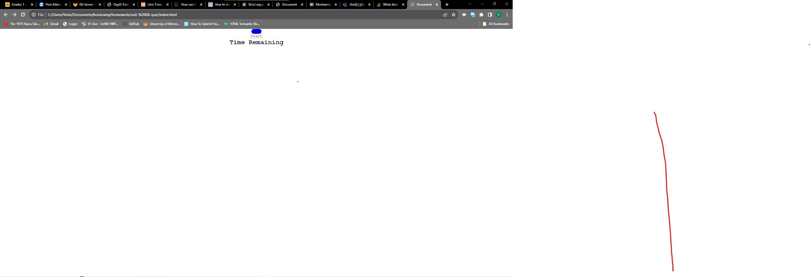

Designed a quiz that should display a total score at the end. Answering correctly prompts a "nice" text to appear. If user were to answer incorrectly prompts "wrong" and a decrease of 5 seconds on the 60 second timer. Attached is a link to the Repo here https://github.com/VictorMontelongo/quiz.
Additionally is a screenshot of the current version of the quiz. 